# 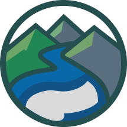 Upper-Cumberland CleanUp

Interactive web map for reporting trash and organizing cleanup efforts in the Upper Cumberland region of Tennessee — starting with Putnam County and all 12 Commission Districts.

**Live:** [uc-cleanup.com](https://uc-cleanup.com)

---

## Screenshots

<table>
<tr>
<td>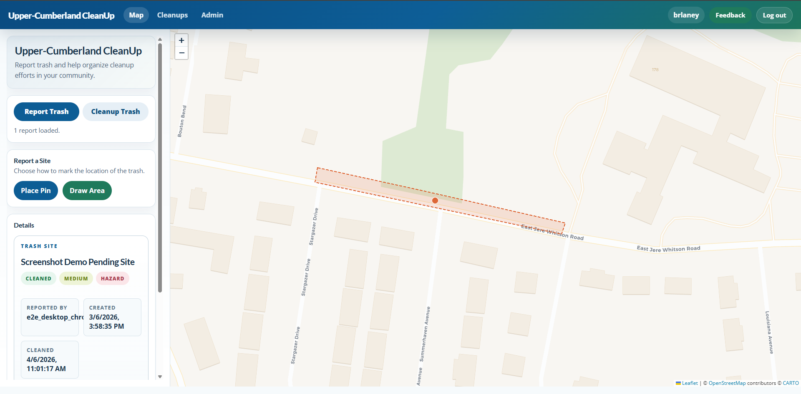</td>
<td>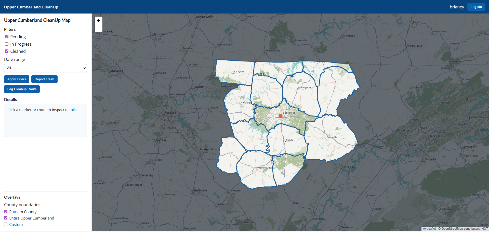</td>
<td>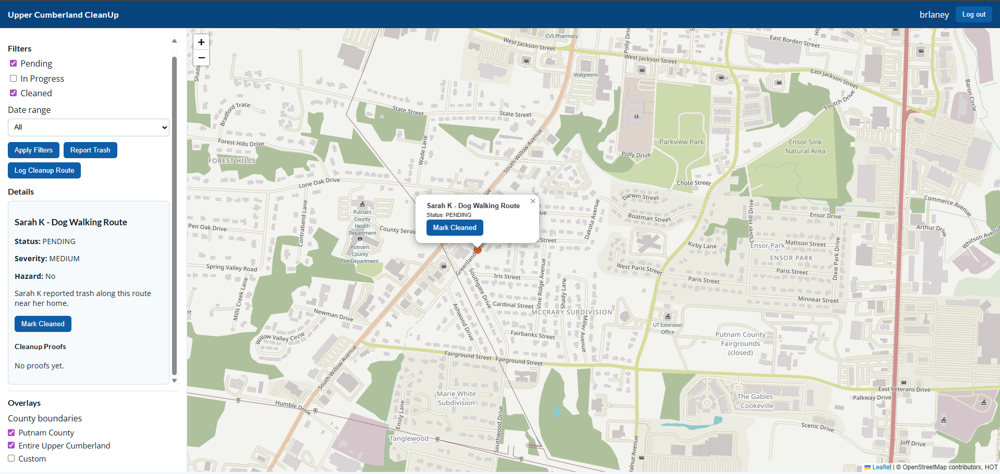</td>
</tr>
<tr>
<td>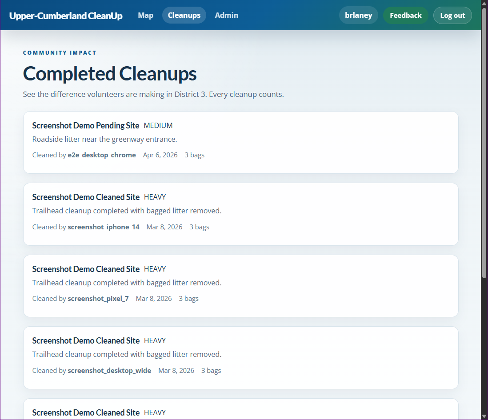</td>
<td>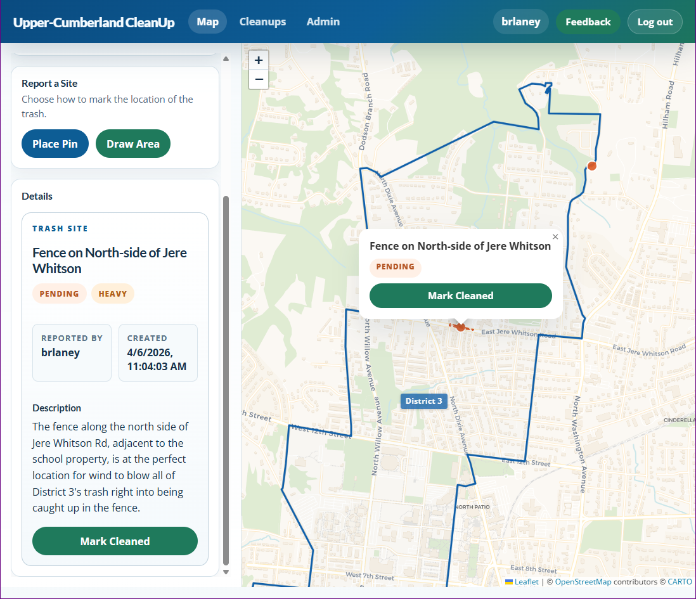</td>
<td>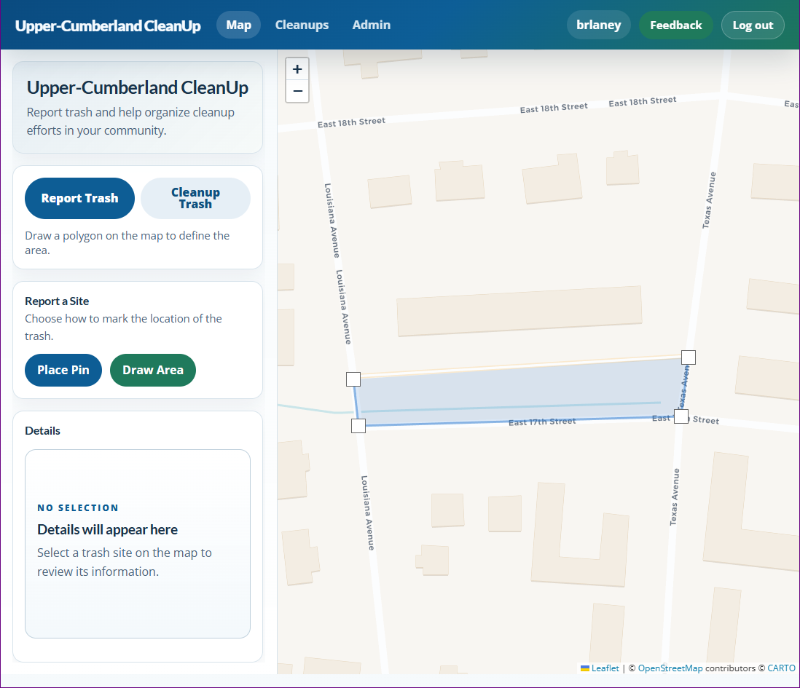</td>
</tr>
</table>

## Mobile

<table>
<tr>
<td>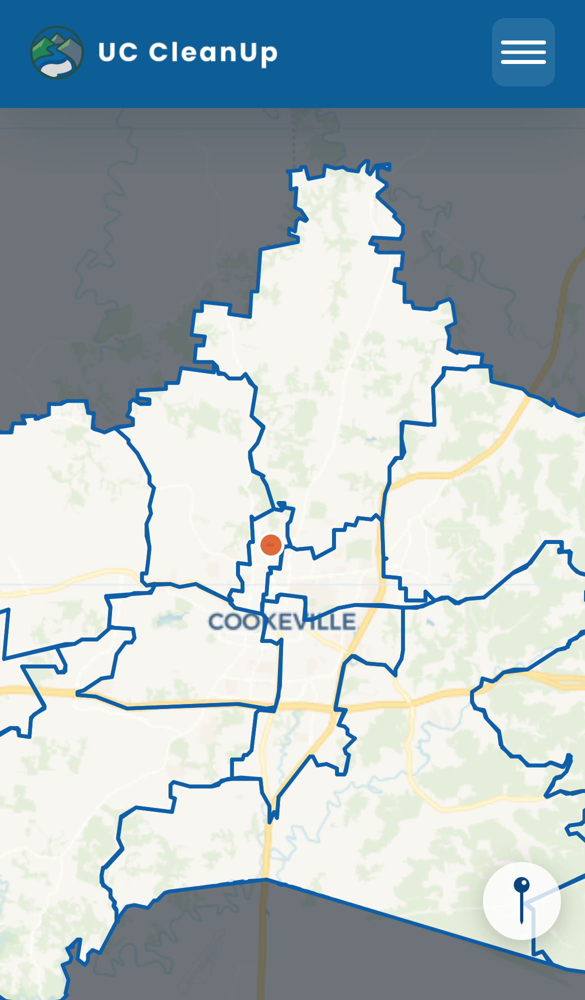</td>
<td>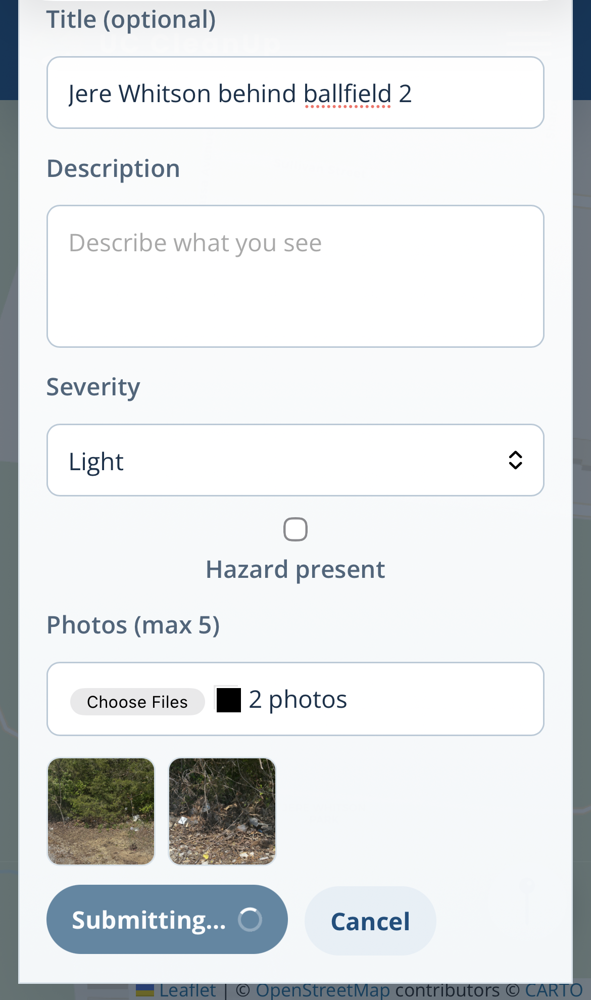</td>
<td>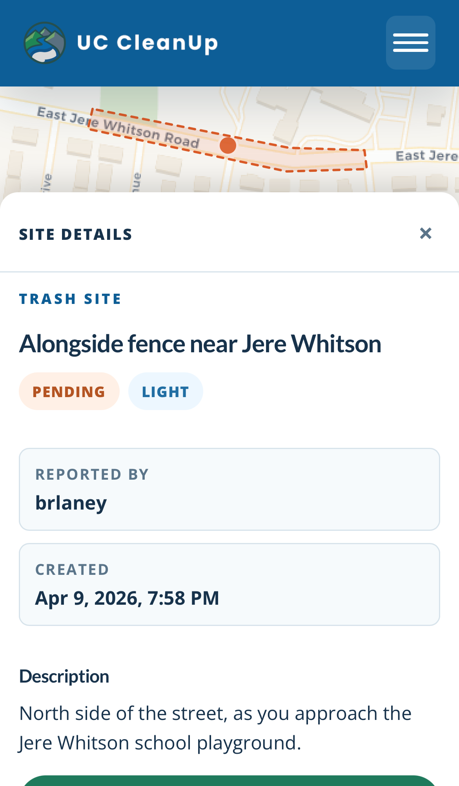</td>
</tr>
<tr>
<td>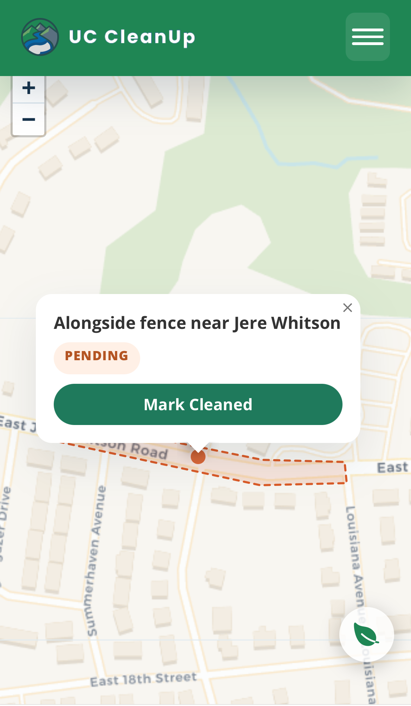</td>
<td>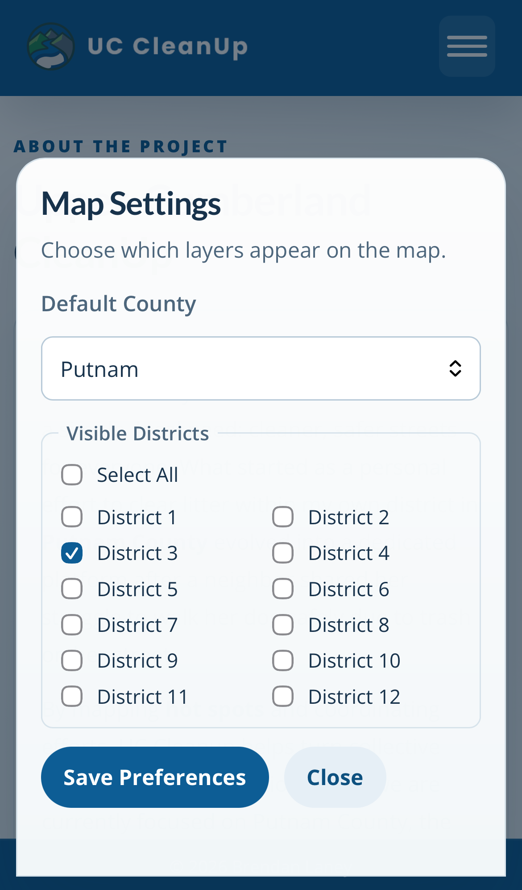</td>
<td>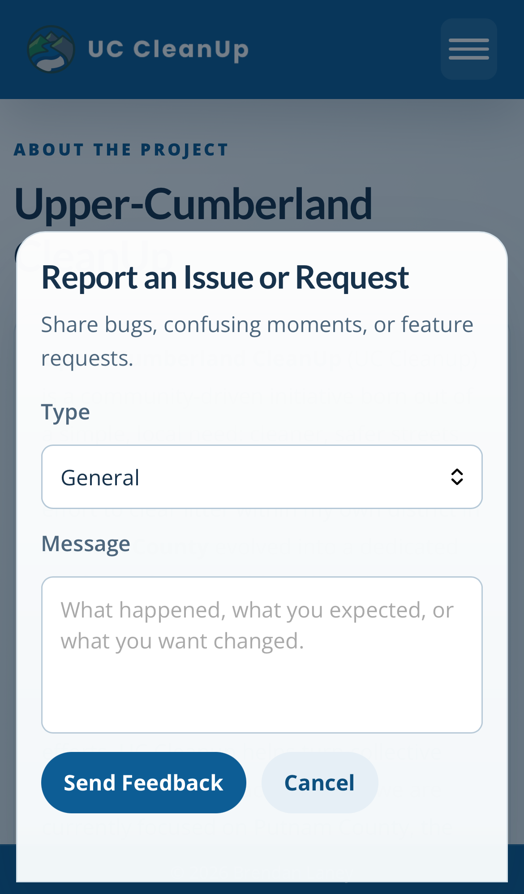</td>
</tr>
</table>

---

## Features

### Reporting & Cleanup
| | |
|---|---|
| **Report Trash** | Place a pin or draw a polygon on the map, set severity (Light / Medium / Heavy), flag hazards, attach up to 5 photos |
| **Cleanup Trash** | Claim any active report, submit before/after photos, bag count, and cleanup notes |
| **Verified Resolution** | Coordinators and admins can officially verify a cleaned site with a work order number — displayed as a badge on the detail panel |
| **Route Logging** | Draw and log a cleanup route with distance tracking |

### Map & Visualization
| | |
|---|---|
| **All 12 Districts** | Putnam County boundary + all 12 Commission District overlays with per-district layer toggles |
| **Hotspot Heatmap** | Visual heat layer showing trash concentration by severity — toggle on/off in the Layers panel |
| **Impact Counter** | Live stats bar showing bags collected, sites cleaned, sites reported, and active volunteers this month |
| **Status Filtering** | Filter map markers by Pending / In Progress / Cleaned in real time |

### Community & Coordination
| | |
|---|---|
| **Leaderboard** | Top 10 volunteers ranked by cleanups this month or all time — opt-in username display |
| **Cleanup Events** | Create, browse, and RSVP to community cleanup events pinned to the map; calendar marker layer |
| **Teams** | Civic groups, schools, scout troops, and churches can create a team, track aggregate contributions (sites, bags, cleanups), and print a certificate |
| **Share Cards** | "Share" button on any cleaned site generates an OpenGraph page for Facebook, X/Twitter, or native Web Share; copy-link fallback |
| **Monthly Report** | Automated email of chronic problem sites (≥ 90 days open) sent to the district rep on the 1st of each month |

### Notifications & PWA
| | |
|---|---|
| **Offline Support** | Full PWA with service worker — submit reports offline and they sync automatically when connectivity returns |
| **Push Notifications** | Subscribe to browser push alerts for new trash reports near your saved location |
| **Event Reminders** | Automated reminder email sent to all RSVP'd attendees 18–30 hours before a cleanup event |
| **Installable App** | Web app manifest — install to home screen on Android/iOS for a standalone, app-like experience |

### Access & Security
| | |
|---|---|
| **Public read** | Map, heatmap, leaderboard, events, teams, and cleanups visible to everyone |
| **Login to write** | Reporting, cleanup proof, RSVPs, and team membership require an account |
| **Role system** | Member → Coordinator (can verify cleanups) → Admin (full access) |
| **Rate limiting** | Per-IP and per-user rate limits on all write endpoints (django-ratelimit) |
| **IP bans** | Admin-managed IP ban table with optional expiry |
| **CSRF + photo validation** | CSRF on all write endpoints; photo uploads validated by count, size, and MIME type |

---

## Tech Stack

| Layer | Technology |
|---|---|
| **Backend** | Python 3.12, Django 5.2, GeoDjango, PostGIS 3.4 |
| **Frontend** | Django templates, Leaflet 1.9.4, leaflet-draw, Leaflet.heat, vanilla JS |
| **Database** | PostgreSQL 16 + PostGIS (Supabase in production) |
| **Storage** | Cloudflare R2 via django-storages + boto3 |
| **Serving** | Gunicorn + WhiteNoise, deployed on Render |
| **Auth** | django.contrib.auth — public read, login required to write |
| **Anti-abuse** | django-ratelimit + IP ban middleware |
| **Push** | pywebpush + VAPID for browser push notifications |
| **PWA** | Service Worker (offline cache + background sync), Web App Manifest |

---

## Local Development

### Prerequisites

- Docker + Docker Compose

### Run

```bash
git clone https://github.com/Brlaney/Upper-Cumberland-CleanUp.git
cd Upper-Cumberland-CleanUp
docker compose up --build
```

App is at `http://localhost:8001`. Putnam County boundary and all 12 Commission District boundaries are seeded automatically on first run.

```bash
# Create a superuser
docker compose exec web python manage.py createsuperuser
```

### Scheduled Commands

Run these on a cron schedule in production:

```bash
# Send reminder emails 18–30 hours before each event (daily)
python manage.py send_event_reminders

# Send monthly chronic-problem-site report to district rep (1st of month)
python manage.py send_monthly_report
```

### Push Notifications (VAPID Keys)

Generate a VAPID key pair and add to your environment:

```bash
python -c "
from py_vapid import Vapid
v = Vapid()
v.generate_keys()
print('Private:', v.private_key)
print('Public: ', v.public_key)
"
```

Then set `VAPID_PRIVATE_KEY`, `VAPID_PUBLIC_KEY`, and `VAPID_EMAIL` in your `.env`.

---

## Environment Variables

| Variable | Description |
|---|---|
| `SECRET_KEY` | Django secret key |
| `DEBUG` | `1` for local dev, `0` for production |
| `DB_CONN_STRING` | Full PostgreSQL connection string (production) |
| `CF_ACCESS_KEY_ID` | Cloudflare R2 access key |
| `CF_SECRET_ACCESS_KEY` | Cloudflare R2 secret |
| `CF_BUCKET_NAME` | R2 bucket name |
| `CF_S3_ENDPOINT_URL` | R2 endpoint URL |
| `CF_S3_CUSTOM_DOMAIN` | R2 public domain for media URLs |
| `USE_S3_MEDIA` | `1` to use R2 for media, `0` for local |
| `DISTRICT_REP_EMAIL` | Email address for monthly problem-site reports |
| `VAPID_PRIVATE_KEY` | VAPID private key for push notifications |
| `VAPID_PUBLIC_KEY` | VAPID public key for push notifications |
| `VAPID_EMAIL` | VAPID contact email (`mailto:you@example.com`) |
| `EMAIL_BACKEND` | Django email backend (defaults to console in dev) |
| `DEFAULT_FROM_EMAIL` | From address for outgoing emails |

---

## API Endpoints

### Public

| Method | Path | Description |
|---|---|---|
| `GET` | `/` | Map view |
| `GET` | `/cleanups/` | Completed cleanups gallery |
| `GET` | `/leaderboard/` | Volunteer leaderboard |
| `GET` | `/events/` | Cleanup events listing |
| `GET` | `/teams/<slug>/` | Public team page |
| `GET` | `/teams/<slug>/certificate/` | Printable team certificate |
| `GET` | `/share/<site-id>/` | OpenGraph share page for a cleaned site |
| `GET` | `/about/` | About page |
| `GET` | `/api/features/` | GeoJSON features (`bbox`, `status`, `days`, `district`) |
| `GET` | `/api/districts/` | Active district boundaries |
| `GET` | `/api/impact/` | Aggregate impact stats (cached 5 min) |
| `GET` | `/api/heatmap/` | Trash density heat points |
| `GET` | `/api/leaderboard/` | Top 10 volunteers (`period=month\|alltime`) |
| `GET` | `/api/events/` | Paginated event list (`status=SCHEDULED\|COMPLETED`) |
| `GET` | `/api/events/<id>/` | Event detail |
| `GET` | `/api/teams/` | All teams with aggregate stats |
| `GET` | `/api/teams/<slug>/` | Single team detail |
| `GET` | `/api/trash-sites/<id>/detail/` | Full site detail |
| `GET` | `/api/cleanups/` | Paginated cleaned sites |
| `GET` | `/api/push/vapid-key/` | VAPID public key for push subscription |
| `GET` | `/healthz` | Health check |
| `GET` | `/sw.js` | Service Worker |

### Authenticated

| Method | Path | Description |
|---|---|---|
| `POST` | `/api/trash-sites/` | Create trash report (multipart, max 5 photos) |
| `PATCH` | `/api/trash-sites/<id>/` | Update site |
| `POST` | `/api/trash-sites/<id>/mark-cleaned/` | Submit cleanup proof |
| `POST` | `/api/trash-sites/<id>/verify/` | Verify cleanup (Coordinator/Admin) |
| `POST` | `/api/events/` | Create cleanup event |
| `POST` | `/api/events/<id>/rsvp/` | RSVP to event |
| `DELETE` | `/api/events/<id>/rsvp/` | Cancel RSVP |
| `POST` | `/api/events/<id>/complete/` | Mark event completed (organizer/admin) |
| `POST` | `/api/teams/` | Create team |
| `POST` | `/api/teams/<slug>/join/` | Join team |
| `POST` | `/api/push/subscribe/` | Subscribe to push notifications |
| `POST` | `/api/push/unsubscribe/` | Unsubscribe from push notifications |
| `GET/POST` | `/api/preferences/` | Map and profile preferences |
| `POST` | `/api/feedback/` | Submit feedback |

---

## Data Model

```
District          — name, slug, geometry (MultiPolygon), active
Profile           — user (1-1), role (MEMBER/COORDINATOR/ADMIN), public_profile
TrashSite         — status, location (Point), area (Polygon), district FK, team FK,
                    title, description, severity, hazard_flag,
                    created_by, claimed_by, verified_by, verified_at,
                    verification_note, work_order, created_at, cleaned_at
CleanupProof      — trash_site FK, route_cleanup FK, note, bags_count,
                    created_by, team FK
Photo             — image, proof FK, photo_type (REPORT/BEFORE/AFTER)
RouteCleanup      — geometry (LineString), distance_miles, notes, created_by
ActivityLog       — activity_type, actor, trash_site FK, summary
CleanupEvent      — title, description, location (Point), district FK,
                    organizer FK, event_date, status, max_attendees
EventRSVP         — event FK, user FK, name, email
Team              — name, slug, org_type, description, leader FK, district FK
TeamMembership    — user FK, team FK, role (LEADER/MEMBER)
PushSubscription  — user FK, endpoint, p256dh, auth_key,
                    saved_location (Point), notification_radius_miles
FeedbackEntry     — feedback_type, status, message, page_url, created_by
IPBan             — ip_address, reason, expires_at
UserMapPreference — user (1-1), default_county, visible_district_slugs
```

---

## License

MIT
